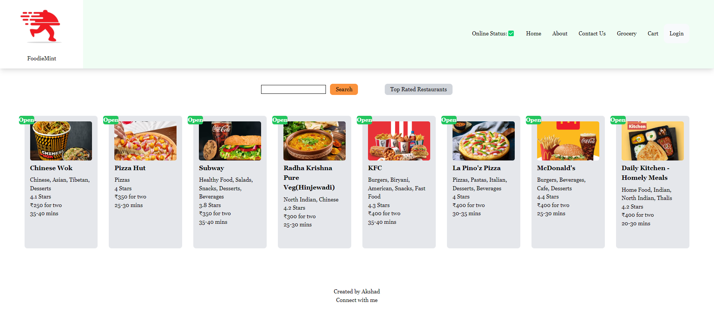
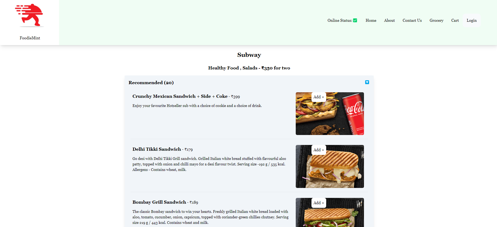

# Namaste React 🙏
## _[Namaste React Course](https://learn.namastedev.com/courses/namaste-react-live) from Zero to Hero 🚀 by [Akshay Saini](https://www.linkedin.com/in/akshaymarch7/) Founder of [NamasteDev](https://courses.namastedev.com/learn/Namaste-React).This repository for Assignment & Class Notes taken during this course._

## [Created a FoodieMint🍥✌️ App from scratch using React and Tailwind ](https://github.com/akshadjaiswal/FoodieMint) 

## FoodieMint:
 

    
    
  

## My React Projects

- HireMint 
- FoodieMint 
- DevTinder (MERN Stack)

## 🎨 Contents:

This repository contains a `Collection of Assignments & Class Notes`, which help you understand the concepts of React.js.

## 📚 [_Chapter 01 - Inception_](https://github.com/akshadjaiswal/Namaste-React/tree/main/Chapter%2001%20Inception)

- 💻 [_Coding_](https://github.com/akshadjaiswal/Namaste-React/tree/main/Chapter%2001%20Inception/Coding)
- 📖 [_Theory_](https://github.com/akshadjaiswal/Namaste-React/tree/main/Chapter%2001%20Inception/Theory)
- 📖 [_Assignment_](https://github.com/akshadjaiswal/Namaste-React/tree/main/Chapter%2001%20Inception/Theory)

## 📚 [_Chapter 02 - Igniting our App_](https://github.com/akshadjaiswal/Namaste-React/tree/main/Chapter%2002%20igniting%20our%20app)

- 💻 [_Coding_](https://github.com/akshadjaiswal/Namaste-React/tree/main/Chapter%2002%20igniting%20our%20app/Coding)
- 📖 [_Theory_](https://github.com/akshadjaiswal/Namaste-React/tree/main/Chapter%2002%20igniting%20our%20app/Theory)
- 📖 [_Assignment_](https://github.com/akshadjaiswal/Namaste-React/tree/main/Chapter%2002%20igniting%20our%20app/Theory)

## 📚 [_Chapter 03 - Laying the Foundation_](https://github.com/akshadjaiswal/Namaste-React/tree/main/Chapter%2003%20Laying%20the%20foundation)

- 💻 [_Coding_](https://github.com/akshadjaiswal/Namaste-React/tree/main/Chapter%2003%20Laying%20the%20foundation/Coding)
- 📖 [_Theory_](https://github.com/akshadjaiswal/Namaste-React/tree/main/Chapter%2003%20Laying%20the%20foundation/Theory)
- 📖 [_Assignment_](https://github.com/akshadjaiswal/Namaste-React/tree/main/Chapter%2003%20Laying%20the%20foundation/Theory)

## 📚 [_Chapter 04 - Talk is Cheap, Show me the Code_](https://github.com/akshadjaiswal/Namaste-React/tree/main/Chapter%2004%20Talk%20is%20Cheap%2C%20show%20me%20the%20code)

- 💻 [_Coding_](https://github.com/akshadjaiswal/Namaste-React/tree/main/Chapter%2004%20Talk%20is%20Cheap%2C%20show%20me%20the%20code/Coding)
- 📖 [_Theory_](https://github.com/akshadjaiswal/Namaste-React/tree/main/Chapter%2004%20Talk%20is%20Cheap%2C%20show%20me%20the%20code/Theory)
- 📖 [_Assignment_](https://github.com/akshadjaiswal/Namaste-React/blob/main/Chapter%2004%20Talk%20is%20Cheap%2C%20show%20me%20the%20code/Theory/Assignment.md)

## 📚 [_Chapter 05 - Let's get Hooked!_](https://github.com/akshadjaiswal/Namaste-React/tree/main/Chapter%2005%20%20%20Let's%20get%20Hooked)

- 💻 [_Coding_](https://github.com/akshadjaiswal/Namaste-React/tree/main/Chapter%2005%20%20%20Let's%20get%20Hooked/Coding)
- 📖 [_Theory_](https://github.com/akshadjaiswal/Namaste-React/tree/main/Chapter%2005%20%20%20Let's%20get%20Hooked/Theory)
- 📖 [_Assignment_](https://github.com/akshadjaiswal/Namaste-React/blob/main/Chapter%2005%20%20%20Let's%20get%20Hooked/Theory/Assignment.md)

## 📚 [_Chapter 06 - Exploring the World_](https://github.com/akshadjaiswal/Namaste-React/tree/main/Chapter%2006%20Exploring%20the%20world)
  
- 💻 [_Coding_](https://github.com/akshadjaiswal/Namaste-React/tree/main/Chapter%2006%20Exploring%20the%20world/Coding)
- 📖 [_Theory_](https://github.com/akshadjaiswal/Namaste-React/tree/main/Chapter%2006%20Exploring%20the%20world/Theory)
- 📖 [_Assignment_](https://github.com/akshadjaiswal/Namaste-React/blob/main/Chapter%2006%20Exploring%20the%20world/Theory/Assignment.md)

## 📚 [_Chapter 07 - Finding the path_](https://github.com/akshadjaiswal/Namaste-React/tree/main/Chapter%2007%20Finding%20the%20path)

- 💻 [_Coding_](https://github.com/akshadjaiswal/Namaste-React/tree/main/Chapter%2007%20Finding%20the%20path/Coding)
- 📖 [_Theory_](https://github.com/akshadjaiswal/Namaste-React/tree/main/Chapter%2007%20Finding%20the%20path/Theory)
- 📖 [_Assignment_](https://github.com/akshadjaiswal/Namaste-React/blob/main/Chapter%2007%20Finding%20the%20path/Theory/Assignment.md)
-

## 📚 [_Chapter 08 Let's Get Classy_](https://github.com/akshadjaiswal/Namaste-React/tree/main/Chapter%2008%20Let's%20Get%20Classy)

- 💻 [_Coding_](https://github.com/akshadjaiswal/Namaste-React/tree/main/Chapter%2008%20Let's%20Get%20Classy/Coding)
- 📖 [_Theory_](https://github.com/akshadjaiswal/Namaste-React/tree/main/Chapter%2008%20Let's%20Get%20Classy/Theory)
- 📖 [_Assignment_](https://github.com/akshadjaiswal/Namaste-React/blob/main/Chapter%2008%20Let's%20Get%20Classy/Theory/Assignment.md)
  
## 📚 [_Chapter 09 Otpimizing Our App_](https://github.com/akshadjaiswal/Namaste-React/tree/main/Chapter%2009%20Optimizing%20Our%20App)

- 💻 [_Coding_](https://github.com/akshadjaiswal/Namaste-React/tree/main/Chapter%2009%20Optimizing%20Our%20App/Coding)
- 📖 [_Theory_](https://github.com/akshadjaiswal/Namaste-React/tree/main/Chapter%2009%20Optimizing%20Our%20App/Theory)
- 📖 [_Assignment_](https://github.com/akshadjaiswal/Namaste-React/tree/main/Chapter%2009%20Optimizing%20Our%20App/Theory/Assignment.md)

## 📚 [_Chapter 10 Jo Dikhta Hai Vh Bikta Hai_](https://github.com/akshadjaiswal/Namaste-React/tree/main/Chapter%2010%20Jo%20Dikhta%20Hai%2C%20Vh%20Bikta%20Hai)

- 💻 [_Coding_](https://github.com/akshadjaiswal/Namaste-React/tree/main/Chapter%2010%20Jo%20Dikhta%20Hai%2C%20Vh%20Bikta%20Hai/Coding)
- 📖 [_Theory_](https://github.com/akshadjaiswal/Namaste-React/tree/main/Chapter%2010%20Jo%20Dikhta%20Hai%2C%20Vh%20Bikta%20Hai/Theory)
- 📖 [_Assignment_](https://github.com/akshadjaiswal/Namaste-React/tree/main/Chapter%2010%20Jo%20Dikhta%20Hai%2C%20Vh%20Bikta%20Hai/Theory/Assignment.md)
  
## 📚 [_Chapter 11 Data Is a New Oil_](https://github.com/akshadjaiswal/Namaste-React/tree/main/Chapter%2011%20%20Data%20Is%20The%20New%20Oil)

- 💻 [_Coding_](https://github.com/akshadjaiswal/Namaste-React/tree/main/Chapter%2011%20%20Data%20Is%20The%20New%20Oil/Coding)
- 📖 [_Theory_](https://github.com/akshadjaiswal/Namaste-React/tree/main/Chapter%2011%20%20Data%20Is%20The%20New%20Oil/Theory)
- 📖 [_Assignment_](https://github.com/akshadjaiswal/Namaste-React/blob/main/Chapter%2011%20%20Data%20Is%20The%20New%20Oil/Theory/Assignment.md)

## 📚 [_Chapter 12 Let's Build Our Store_](https://github.com/akshadjaiswal/Namaste-React/tree/main/Chapter%2012%20%20Let's%20Build%20Our%20Store)

- 💻 [_Coding_](https://github.com/akshadjaiswal/Namaste-React/tree/main/Chapter%2012%20%20Let's%20Build%20Our%20Store/Coding)
- 📖 [_Theory_](https://github.com/akshadjaiswal/Namaste-React/blob/main/Chapter%2012%20%20Let's%20Build%20Our%20Store/Theory)
- 📖 [_Assignment_](https://github.com/akshadjaiswal/Namaste-React/blob/main/Chapter%2012%20%20Let's%20Build%20Our%20Store/Theory/Assignment.md)
  
## 📚 [_Chapter 13 Time to Test your App_](https://github.com/akshadjaiswal/Namaste-React/tree/main/Chapter%2013%20%20Time%20for%20the%20test)

- 💻 [_Coding_](https://github.com/akshadjaiswal/Namaste-React/tree/main/Chapter%2013%20%20Time%20for%20the%20test/Coding)
- 📖 [_Theory_](https://github.com/akshadjaiswal/Namaste-React/blob/main/Chapter%2013%20%20Time%20for%20the%20test/Theory/Session%2013%20Theory.md)
- 📖 [_Assignment_](https://github.com/akshadjaiswal/Namaste-React/blob/main/Chapter%2013%20%20Time%20for%20the%20test/Theory/Assignment.md)

## 🤝 Contribution Guidelines

- Please create an issue with your suggestion.
- If you have notes of your own, and are interested in contributing to this repo, hit a PR ! I'll review it and add it immediately 🤓.

--- 
## More Learning Resources

Explore my additional repositories to deepen your understanding of related topics in the JavaScript ecosystem:

- [Namaste NodeJS](https://github.com/akshadjaiswal/Namaste-Nodejs): A repository focused on learning Node.js concepts, from basics to advanced server-side programming.
- [Namaste Javascript](https://github.com/akshadjaiswal/Namaste-Javascript): A repository dedicated to mastering Javascript, covering foundational and advanced aspects of building interactive UIs.

---
## ✨ Show your support :

Give a ⭐️ if this project helped you and try to contribute and share with your developers.

---

**Made with ❤️ by Akshad Jaiswal**

